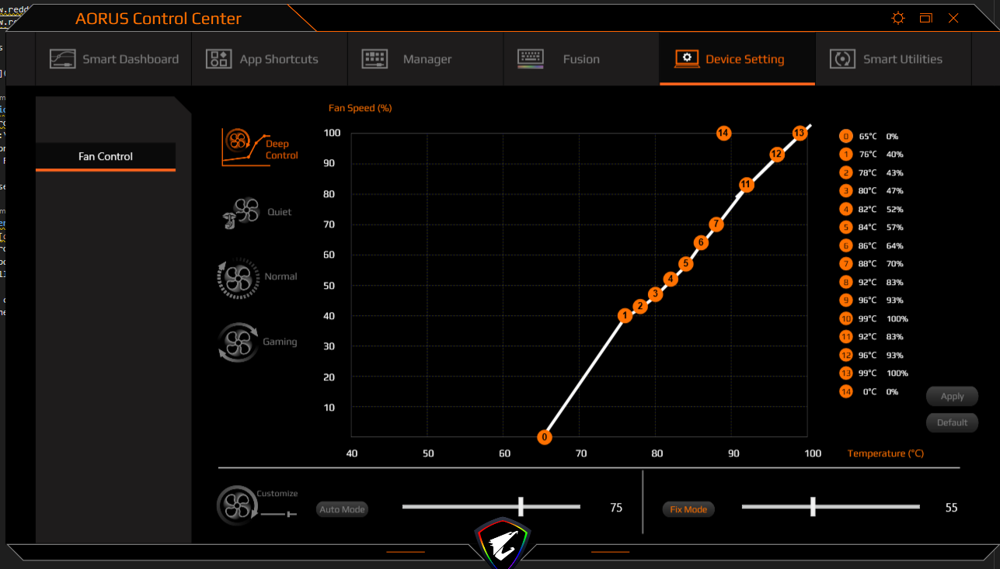

# ControlCenter-DeepFan-Fix 21.05.04.01

There is a number of topics around the interwebs about the limitations of the Gigabyte Control Center software not allowing users to set up their fan profiles they want, for instance:

* <https://www.reddit.com/r/gigabyte/comments/9m83xn/fan_settings_on_gigabyte_aero_15x_to_reduce_noise/>
* <https://www.reddit.com/r/gigabyte/comments/e2w0tv/override_fan_control_on_aero_laptop/>

So to address that, I've decompiled and recompiled the related piece of software, removing this silly restriction.

## FOR 21.05.04.01 ONLY

## Installation

1. Kill ControlCenter background service
2. Replace C:\Program Files\ControlCenter\DeepFan.dll with the fixed one
3. Restart ControlCenter and set up your deep fan profile (point 0) the way YOU want.
4. ENJOY THE FREEDOM TO DO WHAT YOU WANT WITH YOUR DEVICE

Also, after setting up the profile, you need to terminate both AI Widget and ControlCenter.

## Steps taken to make the fix

TODO
<!-- 1. Download [dnSpy](https://github.com/0xd4d/dnSpy/releases) (.net decompilation tool)
2. Open C:\Program Files\ControlCenter\DeepFan.dll
3. Find method `private void checkPointsRule(int i)`
4. Remove silly restriction for point 0
5. Recompile
    - If the compilation complains about lines that look like this: `[global::System.Diagnostics.DebuggerBrowsable(global::System.Diagnostics.DebuggerBrowsableState.Never)]`, just remove them -->

thanks <https://gitlab.com/avdaga> for original fix.
<https://gitlab.com/avdaga/controlcenter-deepfan-fix>